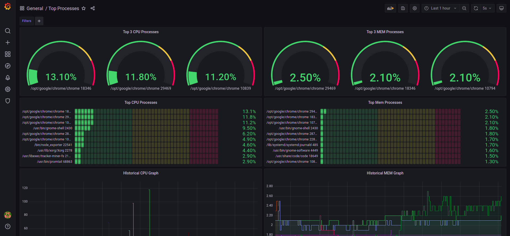
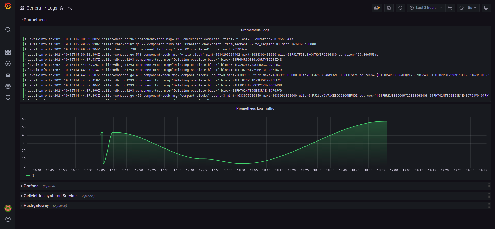

# Monitor Your Top Processes and Docker Logs in Linux with Grafana

### Using Docker, Grafana, Prometheus, PushGateway, Loki, Promtail, Systemd

This repository implements the following:
- Deploy Grafana, Prometheus, PushGateway, Loki, Promtail all together in docker compose under the same bridge network
- Set a bash script as a systemd service in your linux node
- Create a script which fetches metrics with 'ps aux' every second and post them to Prometheus with pushgateway in order to visualize them
- Logging you docker containers and your system logs in Grafana with Loki
- Grafana Dashboards

__Top processes description:__

    You have a bash script which fetches metrics for CPU and MEM and post them to Pushgateway. Pushgateway, whuch is a Prometheus helper for scraping metrics, saves them to our Prometheus. Grafana uses Prometheus as a data source and fetches the metrics using PromQL language.

__Logging description:__

    Promtail scrapes logs from system and docker daemon. Promtail is a Loki helper and Loki is a data source in Grafana. Loki is like Prometheus but for logs.


---

### Step 1: Run Shell Script as SystemD Service  
```bash
# 1. ensure that the script is executable
chmod +x get_system_metrics.sh
# 2. copy the script into /usr/bin
sudo cp get_system_metrics.sh /usr/bin/
# 3. create a Systemd file
sudo nano /lib/systemd/system/get_system_metrics.service
# 4. copy this lines into the file
[Unit]
Description=My Script For System Metrics

[Service]
ExecStart=/usr/bin/get_system_metrics.sh

[Install]
WantedBy=multi-user.target
# 5. reload the daemon and enable the service
sudo systemctl daemon-reload 
sudo systemctl enable get_system_metrics.service

```
*Notice that if you start this service when Pushgateway is down, it fails. You first have to run the Pushgateway service.*

---
### Step 2: Run all Docker services together with docker-compose
All docker services are hosted in the same docker network (name:monitoring_network)
```bash
# run all docker services together
./exec.sh
# terminate all docker services together
./terminate.sh
```
---
### Step 3: Visualize your metrics
```bash
# start systemd service
sudo systemctl start get_system_metrics.service
```
## 1.__Open__ [grafana](http://localhost:3000)
Login and add Prometheus(url: http://prometheus:9090) and Loki(url: http://loki:3100) as Data Sources.

## 2.__Import Dashboards__


_If: you are not familiar with grafana at all you can take a look tou the sources in the bottom of this file._

_Else: Inside the folder grafana/dashboards there are 2 dashboards in json format which you can import to Grafana and view immediately and easy._

### Dashboards:
- ### Top Processes: 

- ### Logs



### Sources
- [Server Monitoring // Prometheus and Grafana Tutorial](https://www.youtube.com/watch?v=9TJx7QTrTyo&ab_channel=TheDigitalLife)
- [Monitoring your docker container’s logs the Loki way](https://itnext.io/monitoring-your-docker-containers-logs-the-loki-way-e9fdbae6bafd)
- [How To Setup Grafana Loki Promtail On Docker](https://www.youtube.com/watch?v=eJtrxj9U_P8&ab_channel=Thetips4you)